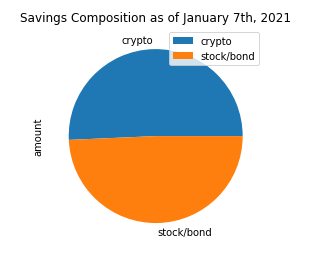

# Financial Planning Tools

---

This program is designed to assist in financial planning by measuring and visualizing the value of an individual's savings portfolios. This program can also be used forecast the performance of a retirement portfolio over a future time horizon to determine the risks and probability of meeting retirement goals.

---

## Program Outputs

Composition of savings:

Monte Carlo portfolio simulation (30 years):

Monte Carlo return distribution (30 years):

Monte Carlo portfolio simulation (10 years):

Monte Carlo return distribution (10 years):

